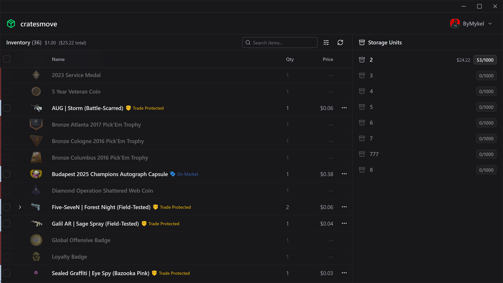

<h1> cratesmove</h1>

**A modern desktop app for managing your CS2 storage units.**

Deposit, retrieve, and organize your Counter-Strike 2 inventory items across storage units — without the clunky in-game interface.

## Features

- **Bulk operations** — Move multiple items to or from storage units at once
- **Item pricing** — See the value of your inventory and each storage unit
- **Multi-account support** — Save and switch between multiple Steam accounts

## Download

Grab the latest release for Windows, macOS, or Linux from the [Releases page](https://github.com/ByMykel/cratesmove/releases).

## Acknowledgements

Inspired by [casemove](https://github.com/nombersDev/casemove), which is no longer maintained.
